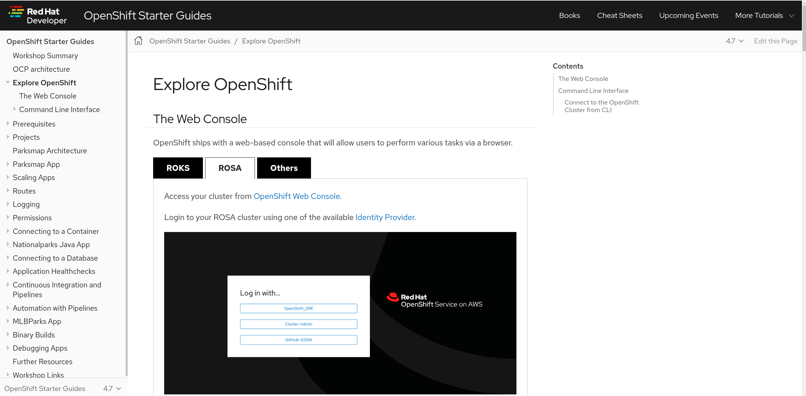
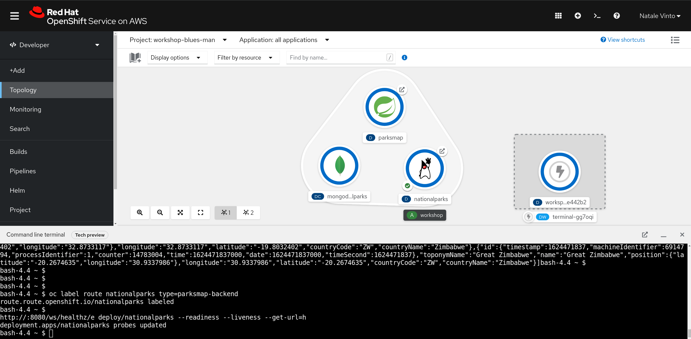

# Getting Started with OpenShift for Developers Hands On Lab (HOWL)

Welcome to your OpenShift Workshop prepared by Red Hat for Orange!

## Instructions

A ROSA (Red Hat OpenShift on AWS) cluster has been created for your beforehand. You can run the Lab inside this cluster with your GitHub user.

https://console-openshift-console.apps.hce.y1pl.p1.openshiftapps.com/

| User      | Lab Guide |
| ----------- | ----------- |
|adriansuciul|[Link](https://redhat-scholars.github.io/openshift-starter-guides/rhs-openshift-starter-guides/4.8/index.html?CLUSTER_SUBDOMAIN=apps.hce.y1pl.p1.openshiftapps.com&PROJECT=workshop-adriansuciul&USERNAME=adriansuciul)|
|alecsandrugh|[Link](https://redhat-scholars.github.io/openshift-starter-guides/rhs-openshift-starter-guides/4.8/index.html?CLUSTER_SUBDOMAIN=apps.hce.y1pl.p1.openshiftapps.com&PROJECT=workshop-alecsandrugh&USERNAME=alecsandrugh)|
|alpamfil|[Link](https://redhat-scholars.github.io/openshift-starter-guides/rhs-openshift-starter-guides/4.8/index.html?CLUSTER_SUBDOMAIN=apps.hce.y1pl.p1.openshiftapps.com&PROJECT=workshop-alpamfil&USERNAME=alpamfil)|
|ammbra|[Link](https://redhat-scholars.github.io/openshift-starter-guides/rhs-openshift-starter-guides/4.8/index.html?CLUSTER_SUBDOMAIN=apps.hce.y1pl.p1.openshiftapps.com&PROJECT=workshop-ammbra&USERNAME=ammbra)|
|AncaDM|[Link](https://redhat-scholars.github.io/openshift-starter-guides/rhs-openshift-starter-guides/4.8/index.html?CLUSTER_SUBDOMAIN=apps.hce.y1pl.p1.openshiftapps.com&PROJECT=workshop-ancadm&USERNAME=AncaDM)|
|ancaenciu|[Link](https://redhat-scholars.github.io/openshift-starter-guides/rhs-openshift-starter-guides/4.8/index.html?CLUSTER_SUBDOMAIN=apps.hce.y1pl.p1.openshiftapps.com&PROJECT=workshop-ancaenciu&USERNAME=ancaenciu)|
|andrein19|[Link](https://redhat-scholars.github.io/openshift-starter-guides/rhs-openshift-starter-guides/4.8/index.html?CLUSTER_SUBDOMAIN=apps.hce.y1pl.p1.openshiftapps.com&PROJECT=workshop-andrein19&USERNAME=andrein19)|
|AurelienBegou|[Link](https://redhat-scholars.github.io/openshift-starter-guides/rhs-openshift-starter-guides/4.8/index.html?CLUSTER_SUBDOMAIN=apps.hce.y1pl.p1.openshiftapps.com&PROJECT=workshop-aurelienbegou&USERNAME=AurelienBegou)|
|baburciu|[Link](https://redhat-scholars.github.io/openshift-starter-guides/rhs-openshift-starter-guides/4.8/index.html?CLUSTER_SUBDOMAIN=apps.hce.y1pl.p1.openshiftapps.com&PROJECT=workshop-baburciu&USERNAME=baburciu)|
|BiancaTofan|[Link](https://redhat-scholars.github.io/openshift-starter-guides/rhs-openshift-starter-guides/4.8/index.html?CLUSTER_SUBDOMAIN=apps.hce.y1pl.p1.openshiftapps.com&PROJECT=workshop-biancatofan&USERNAME=BiancaTofan)|
|blues-man|[Link](https://redhat-scholars.github.io/openshift-starter-guides/rhs-openshift-starter-guides/4.8/index.html?CLUSTER_SUBDOMAIN=apps.hce.y1pl.p1.openshiftapps.com&PROJECT=workshop-blues-man&USERNAME=blues-man)|
|BProdan123|[Link](https://redhat-scholars.github.io/openshift-starter-guides/rhs-openshift-starter-guides/4.8/index.html?CLUSTER_SUBDOMAIN=apps.hce.y1pl.p1.openshiftapps.com&PROJECT=workshop-bprodan123&USERNAME=BProdan123)|
|bsachref|[Link](https://redhat-scholars.github.io/openshift-starter-guides/rhs-openshift-starter-guides/4.8/index.html?CLUSTER_SUBDOMAIN=apps.hce.y1pl.p1.openshiftapps.com&PROJECT=workshop-bsachref&USERNAME=bsachref)|
|cbareau-Orange|[Link](https://redhat-scholars.github.io/openshift-starter-guides/rhs-openshift-starter-guides/4.8/index.html?CLUSTER_SUBDOMAIN=apps.hce.y1pl.p1.openshiftapps.com&PROJECT=workshop-cbareau-orange&USERNAME=cbareau-Orange)|
|cvucu|[Link](https://redhat-scholars.github.io/openshift-starter-guides/rhs-openshift-starter-guides/4.8/index.html?CLUSTER_SUBDOMAIN=apps.hce.y1pl.p1.openshiftapps.com&PROJECT=workshop-cvucu&USERNAME=cvucu)|
|devops-oc1|[Link](https://redhat-scholars.github.io/openshift-starter-guides/rhs-openshift-starter-guides/4.8/index.html?CLUSTER_SUBDOMAIN=apps.hce.y1pl.p1.openshiftapps.com&PROJECT=workshop-devops-oc1&USERNAME=devops-oc1)|
|flebon84|[Link](https://redhat-scholars.github.io/openshift-starter-guides/rhs-openshift-starter-guides/4.8/index.html?CLUSTER_SUBDOMAIN=apps.hce.y1pl.p1.openshiftapps.com&PROJECT=workshop-flebon84&USERNAME=flebon84)|
|gabemot|[Link](https://redhat-scholars.github.io/openshift-starter-guides/rhs-openshift-starter-guides/4.8/index.html?CLUSTER_SUBDOMAIN=apps.hce.y1pl.p1.openshiftapps.com&PROJECT=workshop-gabemot&USERNAME=gabemot)|
|ioudji|[Link](https://redhat-scholars.github.io/openshift-starter-guides/rhs-openshift-starter-guides/4.8/index.html?CLUSTER_SUBDOMAIN=apps.hce.y1pl.p1.openshiftapps.com&PROJECT=workshop-ioudji&USERNAME=ioudji)|
|lordofthejars|[Link](https://redhat-scholars.github.io/openshift-starter-guides/rhs-openshift-starter-guides/4.8/index.html?CLUSTER_SUBDOMAIN=apps.hce.y1pl.p1.openshiftapps.com&PROJECT=workshop-lordofthejars&USERNAME=lordofthejars)|
|mahmoudeltohamy2021|[Link](https://redhat-scholars.github.io/openshift-starter-guides/rhs-openshift-starter-guides/4.8/index.html?CLUSTER_SUBDOMAIN=apps.hce.y1pl.p1.openshiftapps.com&PROJECT=workshop-mahmoudeltohamy2021&USERNAME=mahmoudeltohamy2021)|
|mohamed1-khalifa-ext|[Link](https://redhat-scholars.github.io/openshift-starter-guides/rhs-openshift-starter-guides/4.8/index.html?CLUSTER_SUBDOMAIN=apps.hce.y1pl.p1.openshiftapps.com&PROJECT=workshop-mohamed1-khalifa-ext&USERNAME=mohamed1-khalifa-ext)|
|MossabTN|[Link](https://redhat-scholars.github.io/openshift-starter-guides/rhs-openshift-starter-guides/4.8/index.html?CLUSTER_SUBDOMAIN=apps.hce.y1pl.p1.openshiftapps.com&PROJECT=workshop-mossabtn&USERNAME=MossabTN)|
|msfci|[Link](https://redhat-scholars.github.io/openshift-starter-guides/rhs-openshift-starter-guides/4.8/index.html?CLUSTER_SUBDOMAIN=apps.hce.y1pl.p1.openshiftapps.com&PROJECT=workshop-msfci&USERNAME=msfci)|
|nalaren|[Link](https://redhat-scholars.github.io/openshift-starter-guides/rhs-openshift-starter-guides/4.8/index.html?CLUSTER_SUBDOMAIN=apps.hce.y1pl.p1.openshiftapps.com&PROJECT=workshop-nalaren&USERNAME=nalaren)|
|pegounet1000|[Link](https://redhat-scholars.github.io/openshift-starter-guides/rhs-openshift-starter-guides/4.8/index.html?CLUSTER_SUBDOMAIN=apps.hce.y1pl.p1.openshiftapps.com&PROJECT=workshop-pegounet1000&USERNAME=pegounet1000)|
|reemkamel|[Link](https://redhat-scholars.github.io/openshift-starter-guides/rhs-openshift-starter-guides/4.8/index.html?CLUSTER_SUBDOMAIN=apps.hce.y1pl.p1.openshiftapps.com&PROJECT=workshop-reemkamel&USERNAME=reemkamel)|
|roberttone|[Link](https://redhat-scholars.github.io/openshift-starter-guides/rhs-openshift-starter-guides/4.8/index.html?CLUSTER_SUBDOMAIN=apps.hce.y1pl.p1.openshiftapps.com&PROJECT=workshop-roberttone&USERNAME=roberttone)|
|valdrinium|[Link](https://redhat-scholars.github.io/openshift-starter-guides/rhs-openshift-starter-guides/4.8/index.html?CLUSTER_SUBDOMAIN=apps.hce.y1pl.p1.openshiftapps.com&PROJECT=workshop-valdrinium&USERNAME=valdrinium)|
|yanaga|[Link](https://redhat-scholars.github.io/openshift-starter-guides/rhs-openshift-starter-guides/4.8/index.html?CLUSTER_SUBDOMAIN=apps.hce.y1pl.p1.openshiftapps.com&PROJECT=workshop-yanaga&USERNAME=yanaga)|

